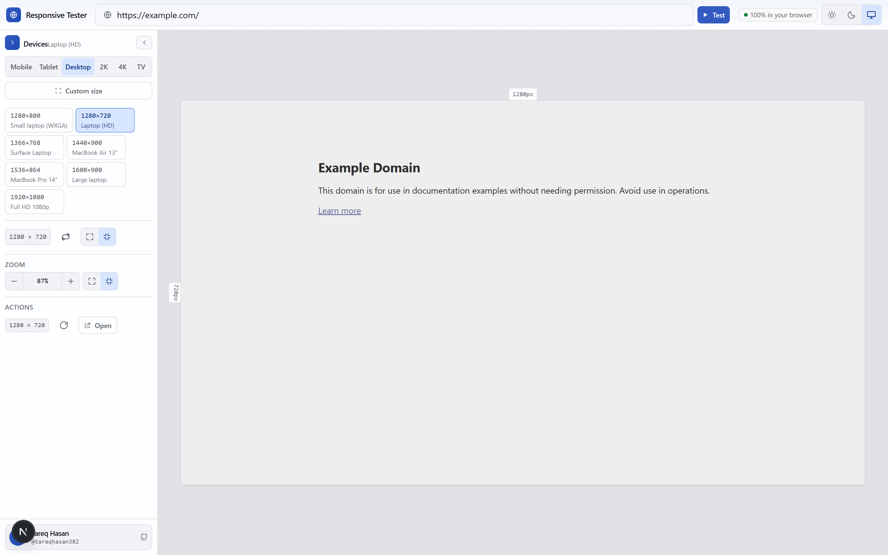

# Responsive UI Tester

[](https://responsive-checker-test.vercel.app)
[](https://nextjs.org)
[](https://www.typescriptlang.org)

Load any URL in an exact-size viewport and check how it responds — media queries,
`vw`/`vh` units, and layout breakpoints evaluated against a real device width.
Runs entirely in the browser.

## 🔗 Live preview

**https://responsive-checker-test.vercel.app**

[](https://responsive-checker-test.vercel.app)

<sub>Screenshot captured from the app at 1440 × 900 (2× DPR).</sub>

## ✨ Features

- **No backend.** No database, auth, or external API calls.
- **Correct measurement.** The iframe is laid out at the exact logical device
  size in CSS pixels and scaled visually, so media queries always resolve
  against the device viewport rather than the window size.
- **29 built-in device presets** (mobile → 4K → Smart TV) plus a custom viewport
  dialog and one-click portrait/landscape rotation.
- **Shareable state.** The target URL is mirrored into `?url=`, and your viewport
  setup persists in `localStorage`.
- **App-router states.** Purpose-built `loading.tsx` skeleton, `not-found.tsx`,
  and `error.tsx` pages, plus complete Open Graph / Twitter SEO metadata.
- **Light & dark themes** that follow the system preference, with no flash of
  the wrong theme on first paint.
- **Keyboard friendly.** Press `R` to reload the framed page.

## Requirements

- Node.js 20.9+ (developed against 24.x)
- npm 10+

## Getting started

```bash
npm install
npm run dev
```

Open <http://localhost:3000>.

> **Use `localhost`, not `127.0.0.1`, when running `next dev`.** Next.js 16
> blocks cross-origin access to dev resources, so loading the dev server over
> `127.0.0.1` leaves the page unhydrated (the UI renders but does not respond).
> If you need the IP form, add `allowedDevOrigins: ['127.0.0.1']` to
> `next.config.ts`.

## Scripts

| Script                 | What it does                               |
| ---------------------- | ------------------------------------------ |
| `npm run dev`          | Development server with hot reload         |
| `npm run build`        | Production build (static export of `/`)    |
| `npm run start`        | Serve the production build                 |
| `npm run typecheck`    | `tsc --noEmit`                             |
| `npm run lint`         | ESLint (flat config, `eslint-config-next`) |
| `npm run lint:fix`     | ESLint with autofix                        |
| `npm run format`       | Prettier write                             |
| `npm run format:check` | Prettier check                             |

Run `typecheck`, `lint`, and `format:check` before opening a PR — all three are
expected to be clean.

## How the viewport works

Most "responsive preview" tools set the iframe's CSS width to a scaled-down
number, which makes `@media` queries fire at the wrong width. This tool does it
the other way around:

1. The iframe element is laid out at the **exact device size in CSS pixels**
   (e.g. 390 × 844), so the page inside sees a genuine 390px-wide viewport.
2. That element is then shrunk to fit the pane with
   `transform: scale(zoom)` and `transform-origin: top left`.
3. Because only the visual transform changes, the frame is never CSS-resized —
   media queries, `vw`, and `vh` stay accurate.

### Height modes

| Mode    | Frame height                 | Use it for                                       |
| ------- | ---------------------------- | ------------------------------------------------ |
| `auto`  | Available pane height ÷ zoom | Scrolling through long pages. **Default.**       |
| `fixed` | Exactly the device height    | Verifying `100vh` / `min-height: 100vh` layouts. |

`auto` is the default because most pages are longer than a phone screen, and a
fixed frame would force you to scroll the frame itself. `auto` caps the frame
at 5000px so a very tall pane cannot produce a pathological document.

### Fit modes

| Mode     | Behaviour                                                        |
| -------- | ---------------------------------------------------------------- |
| `width`  | Fit the frame width to the pane; height follows the height mode. |
| `screen` | Fit the whole device — width _and_ height — into the pane.       |
| `manual` | Use the zoom you set yourself.                                   |

Fit modes never exceed 100%: upscaling a frame makes it blurry and gives a
false impression of fidelity, so `Fit` clamps at 1:1 and you scroll instead.

## Limitations

**Not every site can be framed.** Servers commonly send `X-Frame-Options:
DENY`/`SAMEORIGIN` or a `Content-Security-Policy` with `frame-ancestors`, which
tells the browser to refuse rendering the page inside an iframe. There is no
client-side workaround, because that is the point of those headers. Sites that
allow embedding work fine.

### What is and is not the cause

Measured in Chrome, a blocked frame is **indistinguishable** from a working one
from the parent page:

| target | `load` fires | `error` fires | `contentWindow` |
| --- | --- | --- | --- |
| framable page | yes, ~170 ms | no | `SecurityError` |
| `X-Frame-Options: DENY` | yes, ~830 ms | no | `SecurityError` |
| `X-Frame-Options: SAMEORIGIN` | yes, ~460 ms | no | `SecurityError` |

So a blank preview cannot be auto-detected, which is why **Frame not showing?**
in the sidebar opens a short explainer with copy-paste header fixes instead of
pretending to diagnose. That dialog can only confirm a header when the target
opts into `Access-Control-Expose-Headers`; `X-Frame-Options` and
`Content-Security-Policy` are not CORS-safelisted, so a `null` result means
"hidden", never "absent".

The hosting platform is not the cause. These all load with no framing headers
at all: `react.dev` (Vercel), `vitejs.dev` (Netlify), `docs.netlify.com`,
`www.netlify.com`. It is always the individual app, either its own config or
its framework's default — Nitro/Nuxt sets `X-Frame-Options`, and Helmet blocks
framing for Express.

### Force embed

**Force embed** routes the frame through `src/app/api/embed`, which fetches the
document server-side, drops the headers that cause the refusal, and injects a
`<base href>` so the page's own assets still resolve against the original site.
It is opt-in and off by default, and it helps most with static and
server-rendered pages.

It cannot fix everything, and the failures are structural rather than bugs:

- A client-routed app that builds its own URL from `location` will navigate off
  the proxy. The guard re-homes `pushState`, `replaceState`,
  `location.assign`/`replace` and link clicks back through the proxy, but
  `location.href` is non-configurable in Chrome, so an app that assigns to it
  directly still leaves.
- An app whose data comes from its own API fails once it stops being
  same-origin; the shell renders and the app shows its own error state.
- Anything behind a login or a third-party cookie wall will not render.
- The proxy rejects loopback, link-local, and private ranges, including
  `localhost` and the `169.254.169.254` metadata endpoint, re-checking after
  redirects. Test local dev servers directly instead — they rarely block
  framing, so they do not need the proxy.

Related notes:

- The iframe sends `referrerPolicy="no-referrer"`, so the target does not see
  where it was embedded from.
- The iframe is sandboxed: `allow-scripts allow-same-origin allow-forms
allow-popups allow-popups-to-escape-sandbox allow-modals allow-downloads`.
  Top-level navigation is **not** permitted, so a framed page cannot redirect
  the tester itself. `allow-same-origin` is required for the target to keep its
  own cookies, which is what makes testing `http://localhost:3000` useful.
- A frame that has not fired a load event after 12 seconds is flagged as stalled
  rather than left spinning forever.

## Project structure

```
├── public/
│   └── og.svg                # Open Graph / Twitter card image (1200×630)
├── docs/
│   └── preview.png           # README screenshot
└── src/
    ├── app/                  # Next.js App Router entry, global styles, icon
    │   ├── layout.tsx        # Root layout, SEO metadata, viewport theme color
    │   ├── page.tsx          # Client orchestration: measure pane, geometry, sidebar
    │   ├── loading.tsx       # Global skeleton mirroring the real app shell
    │   ├── not-found.tsx     # 404 page (server component, static HTML)
    │   ├── error.tsx         # Error boundary UI with retry / reload
    │   └── globals.css       # Tailwind v4 @theme tokens + utilities
    ├── components/
    │   ├── device/           # Device preset button + list
    │   ├── layout/           # App shell, header, error boundary, sidebar author card
    │   ├── ui/               # Button, IconButton, Input, Tooltip, Dialog, Popover, icons
    │   ├── url/              # URL bar, quick-target chips, validation message
    │   └── viewport/         # Toolbar, preset picker, frame, preview pane, zoom controls
    ├── config/               # Site/author attribution, theme, device presets
    ├── hooks/                # Persistent state, element size, target URL, viewport, zoom
    ├── lib/                  # `cn` class-name helper (no runtime dependencies)
    ├── types/                # Shared view types
    └── utils/                # URL normalization/validation, viewport math, constants
```

## Adding a device preset

Add an entry to `VIEWPORT_PRESETS` in `src/config/viewport-presets.ts`. Portrait
sizes only — the toolbar derives landscape by rotating:

```ts
{
  id: 'pixel-fold',
  label: 'Pixel Fold',
  // 'mobile' | 'tablet' | 'desktop' | '2k' | '4k' | 'tv' | 'custom'
  category: 'mobile',
  width: 412,
  height: 915,
  devicePixelRatio: 2.625,
},
```

`VIEWPORT_CATEGORIES` controls the order of the category tabs; add the new key
there as well if you introduce a new category.

To change the overall zoom limits or storage keys, edit
`src/utils/constants.ts`.

## Notes on the toolchain

- **TypeScript is pinned to 6.0.3.** `typescript-eslint` does not yet support
  TypeScript 7 and requires `<6.1.0`, so the latest TS would break `npm run
lint`. If you upgrade TypeScript, upgrade `typescript-eslint` in the same
  change and re-run the lint script.
- **Tailwind v4** is configured entirely in CSS: design tokens are declared in
  the `@theme` block in `src/app/globals.css` and exposed as
  `bg-app-canvas`, `text-app-muted`, `border-app-border`, and so on. The
  palette is tuned for a dark developer tool and every text/background pair
  meets WCAG AA (≥ 4.5:1) on the surfaces it is used on.
- `cn()` in `src/lib/cn.ts` is a tiny local class-name joiner. This project has
  no runtime dependencies beyond React, so there is no `clsx`/`tailwind-merge`
  in the bundle.

## Deployment

Live deployment: **https://responsive-checker-test.vercel.app**

Deploys to Vercel with no configuration:

```bash
npx vercel
```

Or push to a Git repository connected to Vercel — the default Next.js preset
builds and serves it as a static site. The app has no server-side code, no
environment variables, and no secrets, so there is nothing else to configure.

The canonical URL, title, and description live in `src/config/site.ts`. That
module is the single source of truth — `layout.tsx` imports from it to build the
SEO metadata, and the sidebar author card reads the GitHub handle from it, so
the URL can never drift between the metadata and the UI. If you fork this
project, update `SITE_URL` there first.

Note that when you test _your_ deployed app, make sure that app's framing
headers permit embedding. If it sends `X-Frame-Options: SAMEORIGIN` and you
deploy both the tester and the app to the same Vercel account, you may still be
blocked — deploy the tester elsewhere or relax the header for your own testing.

## Author

Built by **[Tareq Hasan](https://github.com/tareqhasan382)**.

[](https://github.com/tareqhasan382)
[](https://github.com/tareqhasan382/responsive-checker)

## License

No license file is currently published for this project. Add one (MIT, Apache-2.0,
etc.) before distributing it.
